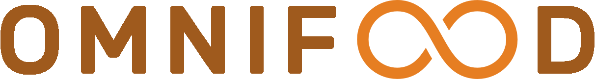

 

    
 Projeto de uma landing page responsiva para uma empresa de alimentação saudável. 

    <h3>💻 TECNOLOGIAS:</h3>
    
    
    
      
    
Desenvolvido durante o curso "Build Responsive Real-World Websites with HTML and CSS" na plataforma Udemy. 

<h3>▶ Como rodar:</h3>

    
Abrir o "index.html" no navegador ou <a href="https://omnifood-bnc.netlify.app/">clicando aqui</a>.

    
O formulário para novos clientes está integrado ao Netlify.

    
    

